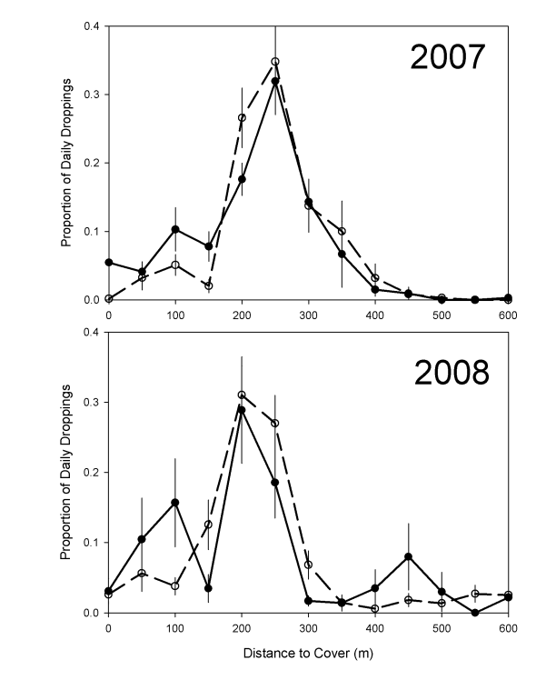

# Reanalysis of dropping counts

I've been thinking about the work I did for my MSC. It has previously been included in a publication [available here](https://onlinelibrary.wiley.com/doi/abs/10.1111/j.1600-048X.2011.05347.x).

The work was also included in my [MSc thesis](http://summit.sfu.ca/system/files/iritems1/9956/etd5864.pdf) and included the following figure.

From the publication, here is the result I found:

> There was a trend for adults to have slightly higher dropping intensity closer to shore, but the distribution of proportion of droppings/m 2 /min did not differ significantly between adults and juveniles in either year (Fig. 5; Kolmogorov–Smirnov test (KS); 2007: D = 0.31, N = 13, P \> 0.10; 2008: D=0.23, N=13, P>0.20).

This was always a bit of a weak sauce for me because I spent a lot of time counting poo out on the mudflats. We did have bigger plans for a detailed analysis, but since I only had one transect of counts and the KS test didn't find anything we decided to keep it simple.

Now that I've learned a thing or two since then, I thought I'd try again to see if I can get a more concrete answer.

I'm going to try using `stan` and Gaussian processes for day of year and distance from shore.
